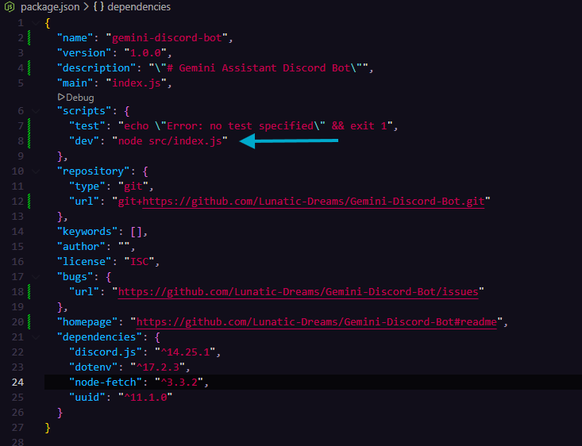

  

<h4 align="center">Gemini Discord Chatbot is a lightweight chatbot with Gemini AI integration powered by Gemini model of your choice.</h4>

<h4 align="center">It’s designed to be easy to setup and easy to use, making it perfect for anyone who wants a simple AI chatbot on their server.</h4>

---

<h1 align="center">Features</h1>

  <strong>⚡ Gemini API Integration</strong> - You can use any Gemini model.  
  <strong>💉 System Instructions Injection</strong> - System instructions are injected into request body.  
  <strong>⚙️ Simple Config</strong> - Settings for each server are being saved into config.  
  <strong>🧩 Command Handler</strong> - Every command is handled by a handler.    
  <strong>💭 Two Conversation Modes</strong> - You can select bot answering behavior.  

---

<h1 align="center">Installation</h1>

<h4 align="center">In order to make this work you need Node.JS, you can download it <a href="https://nodejs.org/en">here.</a></h4>

First you have to clone this repository using:    
  <code>git clone https://github.com/xAwakenDeveloper/Gemini-Discord-Bot.git</code>
     
  Then you have to install required depencies:    
  First install <strong>Discord.js:</strong>    
  <code>npm install discord.js@latest</code>    
  Then install <strong>UUID:</strong>    
  <code>npm install uuid@latest</code>    
  And finally <strong>dotenv:</strong>    
  <code>npm install dotenv@latest</code>  

Now you have to create <code>.env</code> file in root directory which contains five entries:

<code>DISCORD_TOKEN</code> <code>DISCORD_CLIENT_ID</code> <code>GEMINI_API_URL</code> <code>GEMINI_API_KEY</code> <code>SYSTEM_INSTRUCTIONS</code>  

<h4 align="center">Here's an example how it should look:</h4>

  

Now fill your <code>.env</code> entries, grab your <strong>Discord Token</strong> and <strong>Discord Client ID</strong> from <a href="https://discord.com/developers/">Discord Developer Portal</a> and your <strong>Gemini API URL</strong> and <strong>Gemini API Key</strong> from <a href="https://aistudio.google.com/">Google AI Studio</a>.

<h4 align="center">You're good to go, now use <code>node src/index.js</code> command to start the bot and add it to your Discord server.</h4>

<h3 align="center">CHANGE STARTING COMMAND (OPTIONAL)</h3>

<h4 align="center">You can change starting command to <code>npm run dev</code> by editing <code>package.json</code> file. You have to add one line of code: </h4>

  

---

<h1 align="center">How to use</h1>

<h4 align="center">There are three available commands at the moment: <code>/setup</code>, <code>/reset</code> and <code>/clear</code>.</h4>

<h3 align="center">Setup Command:</h3>

All it does is setting up the bot on the server. You have to use it when you add the bot on your server. It stores your server data and your settings.

<h3 align="center">Reset Command:</h3>

It clears your server data from config, pretty basic.

<h3 align="center">Clear Command:</h3>

Clears bot messages, if you had a long conversation with bot you can clear all of it's messages using one command.

---

